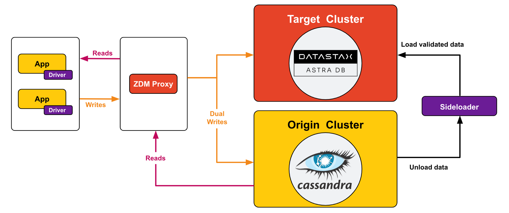

<!-- TOP -->
<div class="top">
  
  <div class="scenario-title-section">
    <span class="scenario-title">Zero Downtime Migration Lab</span>
    <span class="scenario-subtitle">ℹ️ For technical support, please contact us via <a href="mailto:academy@datastax.com">email</a>.</span>
  </div>
</div>

<!-- NAVIGATION -->
<div id="navigation-top" class="navigation-top">
 <a title="Back" href='command:katapod.loadPage?[{"step":"step6"}]' 
   class="btn btn-dark navigation-top-left">⬅️ Back
 </a>
<span class="step-count">Step 7</span>
 <a title="Next" href='command:katapod.loadPage?[{"step":"step8"}]' 
    class="btn btn-dark navigation-top-right">Next ➡️
  </a>
</div>

<!-- CONTENT -->

<div class="step-title">Phase 2: migrate data</div>


#### _🎯 Goal: ensuring historical data, inserted before the introduction of the ZDM Proxy, is present on the Target database._

In order to completely migrate to Target, you must take care
of the _whole_ contents of the database. To this end
you will use the Sideloader, an AstraDB service enabling you to provide a snapshot of your data so that it can be automatically uploaded to Target. You interact with the Sideloader through dedicated DevOps APIs.

Verify that the entries inserted before the switch to using the ZDM Proxy are **not** found on Target.
To do so, **if you went through the Astra CLI path**, launch this command _(editing the database name if different from `zdmtarget`)_:

```bash
### host
astra db cqlsh zdmtarget \
  -k zdmapp \
  -e "SELECT * FROM zdmapp.user_status WHERE user='eva' limit 30;"
```

or, **if you used the Astra UI**, go to the Web CQL Console and run the statement:

```cql
### {"execute": false}
SELECT * FROM zdmapp.user_status WHERE user='eva' limit 30;
```

You should see just the few rows written once you restarted the API to take advantage of the ZDM Proxy.

Take a snapshot of all the data in the keyspace `zdmapp` on Origin, calling your snapshot `data_migration_snapshot` :
```bash
### {"terminalId": "host", "backgroundColor": "#C5DDD2"}
docker exec \
  -it cassandra-origin-1 \
  nodetool snapshot -t data_migration_snapshot zdmapp
```

Next you have to initialize the Sideloader data migration for Target. The initialization API returns immediately and gives you a `migrationID`, which will be needed in the rest of the process.
Additionally, the API asynchronously creates a migration directory into a secure bucket, and some credentials for read and write access.

Execute the following command to call the initialization API and store the `migrationID` into an environment variable:
```bash
### {"terminalId": "host", "backgroundColor": "#C5DDD2"}
MIGRATION_ID=$(curl -X POST \
    -H "Authorization: Bearer ${ASTRA_DB_APPLICATION_TOKEN}" \
    https://api.astra.datastax.com/v2/databases/${ASTRA_DB_ID}/migrations/initialize \
    | jq '.migrationID' | tr -d '"')
```

Periodically check the status of your migration until you see it switching to `ReceivingFiles`:
```bash
### {"terminalId": "host", "backgroundColor": "#C5DDD2"}
curl -X GET \
    -H "Authorization: Bearer ${ASTRA_DB_APPLICATION_TOKEN}" \
    https://api.astra.datastax.com/v2/databases/${ASTRA_DB_ID}/migrations/${MIGRATION_ID} \
    | jq .
```

When the status switches to `ReceivingFiles`, the initialization is complete. At this point, the status response contains several values that will be needed in the next steps.
These values are:
 - The migration directory to which the snapshot must be uploaded.
 - The credentials components that grant access to the migration directory.

Run the following command to store these values into environment variables: 
```bash
### {"terminalId": "host", "backgroundColor": "#C5DDD2"}
curl -X GET \
    -H "Authorization: Bearer ${ASTRA_DB_APPLICATION_TOKEN}" \
    https://api.astra.datastax.com/v2/databases/${ASTRA_DB_ID}/migrations/${MIGRATION_ID} \
    | jq . > init_complete_output.json
MIGRATION_DIR=$(jq '.uploadBucketDir' init_complete_output.json | tr -d '"')
ACCESS_KEY_ID=$(jq '.uploadCredentials.keys.accessKeyID' init_complete_output.json | tr -d '"')
SECRET_ACCESS_KEY=$(jq '.uploadCredentials.keys.secretAccessKey' init_complete_output.json | tr -d '"')
SESSION_TOKEN=$(jq '.uploadCredentials.keys.sessionToken' init_complete_output.json | tr -d '"')
```

Now you are ready to upload your snapshot to the migration directory. To do so, you will use the AWS CLI that is pre-installed on your Origin node. Remember that your Origin node runs as a Docker container, so the command below needs to pass the required environment variables from the host to the container.

Run the following command:
```bash
### {"terminalId": "host", "backgroundColor": "#C5DDD2"}
docker exec \
  -e AWS_ACCESS_KEY_ID=$ACCESS_KEY_ID \
  -e AWS_SECRET_ACCESS_KEY=$SECRET_ACCESS_KEY \
  -e AWS_SESSION_TOKEN=$SESSION_TOKEN \
  -e MIGRATION_DIR=$MIGRATION_DIR \
  -it cassandra-origin-1 \
  aws s3 sync --only-show-errors --exclude '*' --include '*/snapshots/data_migration_snapshot*' /var/lib/cassandra/data/ $MIGRATION_DIR/node1
```

Check that the data has been uploaded correctly to the migration directory:
```bash
### {"terminalId": "host", "backgroundColor": "#C5DDD2"}
docker exec \
  -e AWS_ACCESS_KEY_ID=$ACCESS_KEY_ID \
  -e AWS_SECRET_ACCESS_KEY=$SECRET_ACCESS_KEY \
  -e AWS_SESSION_TOKEN=$SESSION_TOKEN \
  -e MIGRATION_DIR=$MIGRATION_DIR \
  -it cassandra-origin-1 \
  aws s3 ls --recursive $MIGRATION_DIR
```

When the upload is complete, you are finally ready to launch the migration by calling the following API:
```bash
### {"terminalId": "host", "backgroundColor": "#C5DDD2"}
curl -X POST \
    -H "Authorization: Bearer ${ASTRA_DB_APPLICATION_TOKEN}" \
    https://api.astra.datastax.com/v2/databases/${ASTRA_DB_ID}/migrations/${MIGRATION_ID}/launch \
    | jq .
```

This API returns immediately after launching a long-running background process that imports your snapshot into Target.

You can monitor the process through the same status API call as above:
```bash
### {"terminalId": "host", "backgroundColor": "#C5DDD2"}
curl -X GET \
    -H "Authorization: Bearer ${ASTRA_DB_APPLICATION_TOKEN}" \
    https://api.astra.datastax.com/v2/databases/${ASTRA_DB_ID}/migrations/${MIGRATION_ID} \
    | jq .
```
The final status for a successful migration is `MigrationDone`. 

Once the Sideloader process has completed, you will see that now _all_ rows are
on Target as well, including those written prior to setting up
the ZDM Proxy.

To verify this,
**if you went through the Astra CLI path**, launch this command _(editing the database name if different from `zdmtarget`)_:

```bash
### host
astra db cqlsh zdmtarget \
  -k zdmapp \
  -e "SELECT * FROM zdmapp.user_status WHERE user='eva' limit 30;"
```

or, **if you used the Astra UI**, go to the Web CQL Console and run the statement:

```cql
### {"execute": false}
SELECT * FROM zdmapp.user_status WHERE user='eva' limit 30;
```

From this moment on, the data on Target will not diverge from Origin
until the moment you decide to cut over and neglect Origin altogether.

#### _🗒️ At this point, you might wonder whether Target is actually capable of sustaining the read workload your applications demand. Well, the perfect way to address this concern is to have the proxy perform asynchronous dual reads on it. Read on to find out._



#### 🔎 Monitoring suggestion

Since the data migrator connects **directly to Origin and Target, oblivious to
the ZDM Proxy**, the migration workload will not be reflected in the monitoring.
You can confirm this by looking at the proxy instance graphs, which will show
no read activity and the usual background write activity.
In other words, the data migration occurs outside of the proxy's scope,
hence will not be part of the metrics collected in the Grafana dashboard.

<!-- NAVIGATION -->
<div id="navigation-bottom" class="navigation-bottom">
 <a title="Back" href='command:katapod.loadPage?[{"step":"step6"}]'
   class="btn btn-dark navigation-bottom-left">⬅️ Back
 </a>
 <a title="Next" href='command:katapod.loadPage?[{"step":"step8"}]'
    class="btn btn-dark navigation-bottom-right">Next ➡️
  </a>
</div>
